# DDoS 攻击溯源分析器需求规格说明书

## 文档信息

| 项目 | 内容 |
|------|------|
| 文档名称 | DDoS 攻击溯源分析器需求规格说明书 |
| 版本 | v4.0 |
| 编写日期 | 2026-04-14 |
| 状态 | 待评审 |

### 变更记录

| 版本 | 日期 | 变更内容 |
|------|------|---------|
| v3.0 | 2026-04-13 | 初始版本，基于 ClickHouse 数据源 |
| v4.0 | 2026-04-14 | 新增告警驱动分析模式：从 `detect_attack_dist` 表自动获取阈值、时间窗口和攻击类型 |

---

## 1. 项目概述

### 1.1 项目背景

分布式拒绝服务攻击（DDoS）是网络安全领域的重大威胁。当攻击发生时，网络管理员需要快速识别攻击源 IP、分析攻击特征、追踪攻击路径，以便采取有效的防御措施。本项目旨在开发一个自动化的 DDoS 攻击溯源分析器，基于 NetFlow 数据进行智能化分析。

### 1.2 项目目标

1. **自动识别攻击源**：从海量 NetFlow 数据中自动识别 DDoS 攻击源 IP
2. **特征分析**：对每个攻击源进行多维度行为特征分析
3. **指纹聚类**：识别僵尸网络团伙或使用相同工具的攻击群体
4. **路径溯源**：追踪攻击流量从哪个骨干接口进入被防护网络
5. **可视化报告**：生成结构化的分析报告和可视化图表

### 1.3 分析粒度

以源 IP（`src_ip_addr`）为单位进行聚合分析，每个源 IP 作为一个独立的分析实体。

---

## 2. 功能需求

### 2.1 数据加载与过滤（Phase 0）

#### 2.1.1 ClickHouse 数据源配置

**需求描述**：
- 支持从 ClickHouse 数据库查询 NetFlow 数据
- 表结构：`analytics_netflow_dist`
- 查询目标：`dst_ip_addr` 和 `dst_mo_code` 组合的入向流量

**核心查询逻辑**：
```sql
SELECT 
    src_ip_addr,
    dst_ip_addr,
    octets,           -- 已乘以采样比的字节数
    packets,          -- 已乘以采样比的包数
    src_port,
    dst_port,
    tcp_flags,
    protocol,
    input_if_index,
    output_if_index,
    first_time,       -- 开始时间戳（毫秒）
    last_time,        -- 结束时间戳（毫秒）
    parser_rcv_time,  -- 解析单元接收时间（毫秒）← 主要时间字段
    src_mo_name,
    src_mo_code,
    dst_mo_name,
    dst_mo_code,
    src_country,
    src_province,
    src_city,
    src_isp,
    dst_country,
    dst_province,
    dst_city,
    dst_isp
FROM analytics_netflow_dist
WHERE 
    dst_ip_addr IN (?1)          -- 目的IP列表（入向流量）
    AND dst_mo_code IN (?2)       -- 目的监测对象编码
    AND app_rcv_time BETWEEN ?3 AND ?4  -- 时间范围
```

#### 2.1.2 入向流量过滤

**需求描述**：
- 只分析流向目标 IP 的入向流量（`dst_ip_addr ∈ target_ips`）
- 同时过滤指定监测对象（`dst_mo_code ∈ target_mo_codes`）
- 若 `target_ips` 为空则保留全部数据（全量分析模式）
- 排除从目标 IP 发出的响应包（确保是入向流量）

**数据筛选条件**：
```sql
WHERE dst_ip_addr IN (target_ips)      -- 当指定目标IP时
  AND dst_mo_code IN (target_mo_codes) -- 当指定监测对象时
  AND service_dir = 'inbound'          -- 确保是入向流量
```

#### 2.1.3 时间字段解析

**需求描述**：
- 使用 `parser_rcv_time`（毫秒时间戳）作为主要时间基准
- 转换为 datetime 类型，命名为 `flow_time`
- 作为后续时序分析的时间字段

**字段选择理由**：
- `parser_rcv_time` 是解析单元接收时间，精度更高
- 单位统一（毫秒），便于时序分析
- 相比 `first_time` / `last_time` 更具一致性
- `app_rcv_time` 是应用层收到的时间，可能存在处理延迟

**时间格式转换**：
```python
# 原始数据（毫秒时间戳）
parser_rcv_time: 1677619200000

# 转换后
flow_time: datetime(2023-03-01 12:00:00)
```

#### 2.1.4 字段映射与预处理

**原始字段 → 处理后字段映射**：

| 原始字段 | 用途 | 处理方式 |
|---------|------|---------|
| `octets` | 字节数统计 | 直接使用（已含采样比） |
| `packets` | 包数统计 | 直接使用（已含采样比） |
| `parser_rcv_time` | 时间基准 | 转换为 datetime |
| `first_time` | 流开始时间 | 可用于分析持续时间 |
| `last_time` | 流结束时间 | 可用于分析持续时间 |
| `tcp_flags` | TCP 标志 | 提取主要标志位 |
| `src_port` | 源端口 | 端口多样性分析 |
| `dst_port` | 目的端口 | 目标端口分析 |
| `input_if_index` | 入接口 | 路径溯源分析 |
| `output_if_index` | 出接口 | 路径溯源分析 |
| `src_mo_code` | 源监测对象 | 业务关联分析 |
| `dst_mo_code` | 目的监测对象 | 业务关联分析 |
| `src_country` | 源国家 | 地理溯源 |
| `src_province` | 源省份 | 地理溯源 |
| `src_city` | 源城市 | 地理溯源 |
| `src_isp` | 源运营商 | 地理溯源 |
| `dst_country` | 目的国家 | 地理溯源 |
| `dst_province` | 目的省份 | 地理溯源 |
| `dst_city` | 目的城市 | 地理溯源 |
| `dst_isp` | 目的运营商 | 地理溯源 |

**采样比处理**：
- 原始数据中的 `octets` 和 `packets` 已经是乘以 `flow_sample_rate` 后的值
- 无需再进行采样比计算，直接使用原始数值

---

### 2.2 告警驱动分析入口（Phase 0.5）

#### 2.2.1 设计背景

不同检测对象的攻击阈值各不相同，且不同攻击类型的阈值也不同，无法使用配置文件中的固定阈值。
因此需要从告警表 `detect_attack_dist` 中自动获取每个攻击事件的阈值、时间窗口和攻击类型。

#### 2.2.2 告警表结构（detect_attack_dist）

| 字段 | 类型 | 说明 |
|------|------|------|
| `id` | Int64 | 主键 |
| `attack_id` | String | 攻击ID（多条记录可共用同一 attack_id） |
| `attack_target` | String | 攻击目标（IP / 监测对象编码 / 客户子网） |
| `attack_target_type` | String | 目标类型：ipv4 / ipv6 / customer / router / interface / mo |
| `level` | String | 告警级别：LOW / MEDIUM / HIGH |
| `status` | String | 状态：start / onging / end |
| `attack_types` | String | 攻击类型列表（逗号分隔），如 syn,ack,udp |
| `attack_maintype` | String | 主要攻击类型 |
| `threshold_unit` | String | 阈值单位 |
| `threshold` | Int32 | 阈值 |
| `direction` | String | 攻击方向：in / out |
| `start_time` | DateTime | 开始时间 |
| `end_time` | DateTime | 结束时间 |
| `max_pps` | Float64 | 最大攻击包速 |
| `max_bps` | Float64 | 最大攻击流速 |
| `mean_packet_ps` | Float64 | 平均攻击包速 |
| `mean_bytes_ps` | Float64 | 平均攻击流速 |
| `duration` | Int64 | 持续时间（毫秒） |

#### 2.2.3 三种入口模式

| 入口 | 方法 | 阈值来源 | 适用场景 |
|------|------|---------|---------|
| **告警ID**（推荐） | `run_analysis_by_alert(attack_id)` | 告警表自动获取 | 告警触发后自动溯源 |
| **攻击目标** | `run_analysis_by_target(attack_target, start_time, end_time)` | 告警表自动获取，未找到则用配置默认值 | 按IP或监测对象分析 |
| **手动传参** | `run_full_analysis(target_ips, target_mo_codes, start_time, end_time)` | 配置文件默认阈值 | 兼容旧接口 |

#### 2.2.4 AttackContext 数据结构

`AlertLoader` 将告警记录合并为 `AttackContext`：

```python
@dataclass
class AttackContext:
    attack_id: Optional[str]
    attack_target: str
    attack_target_type: str        # ipv4 / mo / customer ...
    target_ips: List[str]
    target_mo_codes: List[str]
    start_time: Optional[datetime]
    end_time: Optional[datetime]
    threshold_pps: Optional[float]  # 从告警表获取的 PPS 阈值
    threshold_bps: Optional[float]  # 从告警表获取的 BPS 阈值
    attack_types: List[str]         # 合并所有攻击类型
    attack_maintype: Optional[str]
    direction: str
    level: str
    max_pps: Optional[float]
    max_bps: Optional[float]
```

#### 2.2.5 告警阈值获取逻辑

1. 从 `threshold` + `threshold_unit` 字段解析：如果 unit 包含 `pps`/`packet` 则为 PPS 阈值，包含 `bps`/`byte`/`mb` 则为 BPS 阈值
2. 如果无法从 threshold 字段获取，则用 `max_pps * 0.5` 作为保守阈值
3. 如果告警记录不存在（`run_analysis_by_target` 模式），回退到配置文件默认值

#### 2.2.6 多条告警合并规则

一个 `attack_id` 可能对应多条告警记录，合并规则：
- **target_ips**：`attack_target_type == "ipv4"` 时取所有唯一 `attack_target`
- **target_mo_codes**：`attack_target_type == "mo"` 时取所有唯一 `attack_target`
- **时间窗口**：取最早 `start_time` 和最晚 `end_time`
- **阈值**：取最大 `threshold` 值
- **攻击类型**：合并所有记录的 `attack_types`（去重）

---

### 2.3 特征工程（Phase 1）

#### 2.2.1 基础聚合特征

按 `src_ip_addr` 分组，计算以下聚合特征：

| 类别 | 特征名称 | 说明 | 数据来源 |
|------|---------|------|---------|
| 包统计 | `total_packets` | 总包数 | `packets` 字段求和 |
| | `avg_packets` | 平均包数（每流） | `packets` 字段均值 |
| | `std_packets` | 包数标准差 | `packets` 字段标准差 |
| | `max_packets` | 最大包数 | `packets` 字段最大值 |
| | `min_packets` | 最小包数 | `packets` 字段最小值 |
| 字节统计 | `total_bytes` | 总字节数 | `octets` 字段求和 |
| | `avg_bytes` | 平均字节数（每流） | `octets` 字段均值 |
| | `std_bytes` | 字节数标准差 | `octets` 字段标准差 |
| | `max_bytes` | 最大字节数 | `octets` 字段最大值 |
| 多样性 | `dst_port_count` | 目标端口数 | `dst_port` 去重计数 |
| | `src_port_count` | 源端口数 | `src_port` 去重计数 |
| | `protocol_count` | 协议类型数 | `protocol` 去重计数 |
| 时间特征 | `flow_start_time` | 首条流时间 | `parser_rcv_time` 最小值 |
| | `flow_end_time` | 末条流时间 | `parser_rcv_time` 最大值 |
| | `flow_duration` | 持续时间（秒） | `flow_end_time - flow_start_time` |
| 地理特征 | `country` | 国家 | `src_country` 众数 |
| | `province` | 省份 | `src_province` 众数 |
| | `city` | 城市 | `src_city` 众数 |
| | `isp` | 运营商 | `src_isp` 众数 |
| | `as_number` | 自治系统号 | `src_as` 众数 |
| 监测对象 | `src_mo_name` | 源监测对象名称 | `src_mo_name` 众数 |
| | `src_mo_code` | 源监测对象编码 | `src_mo_code` 众数 |
| | `dst_mo_name` | 目的监测对象名称 | `dst_mo_name` 众数 |
| | `dst_mo_code` | 目的监测对象编码 | `dst_mo_code` 众数 |
| 路径特征 | `input_if_count` | 入接口数量 | `input_if_index` 去重计数 |
| | `output_if_count` | 出接口数量 | `output_if_index` 去重计数 |
| | `flow_ip_count` | 路由器IP数量 | `flow_ip_addr` 去重计数 |

#### 2.2.2 衍生特征

基于基础特征计算衍生指标：

| 特征名称 | 计算公式 | 说明 |
|---------|---------|------|
| `bytes_per_packet` | `total_bytes / total_packets` | 平均包大小 |
| `packets_per_sec` | `total_packets / flow_duration` | 平均每秒包数 |
| `bytes_per_sec` | `total_bytes / flow_duration` | 平均每秒字节数 |
| `burst_ratio` | `max_packets / avg_packets` | 突发比例 |
| `bytes_std_ratio` | `std_bytes / avg_bytes` | 字节变异性 |
| `dst_port_concentration` | 向量化计算 | 端口集中度（Herfindahl指数） |
| `dominant_tcp_flag` | TCP 标志众数 | 主导 TCP 标志 |

#### 2.2.3 时序特征

通过 `_extract_temporal_features()` 方法计算：

**实现方式**：全向量化 `groupby.diff()`，无逐 IP 循环

| 特征名称 | 计算方式 | 说明 |
|---------|---------|------|
| `flow_interval_mean` | 相邻流时间间隔均值 | 平均流量间隔（基于 `parser_rcv_time`） |
| `flow_interval_std` | 相邻流时间间隔标准差 | 流量间隔波动 |
| `flow_interval_cv` | `std / mean` | 变异系数（要求 flow_count ≥ 5） |
| `active_ratio` | 活跃时间占比 | 流量分布的集中度 |
| `burst_count` | 间隔 < 1s 的次数 | 突发次数 |
| `max_burst_size` | 最大连续突发数量 | 最大突发规模 |
| `flow_count` | 总流记录数 | 分组内的流总数 |

**时间间隔计算**：
```python
# 基于 parser_rcv_time 计算时间间隔
sorted_flows = group.sort_values('parser_rcv_time')
time_diffs = sorted_flows['parser_rcv_time'].diff()
```

---

### 2.3 流量基线建模（Phase 1.5）

#### 2.3.1 基线计算策略

**关键设计**：先排除攻击 IP 再建基线

**理由**：
- 若攻击源占总 IP 的 20%+，直接用全量计算的均值/标准差会被拉偏
- 导致 z-score 失真，攻击源评分反而偏低

**执行步骤**：
1. 初步筛选正常 IP：`PPS < 500k AND BPS < 20M`
2. 若样本数 < 10，退化使用全量数据计算基线
3. 对 6 个核心指标分别计算统计量

#### 2.3.2 基线统计量

对以下核心指标计算基线统计量：
- `packets_per_sec`
- `bytes_per_sec`
- `bytes_per_packet`
- `burst_ratio`
- `flow_interval_mean`
- `flow_interval_cv`

**统计量列表**：
```
mean, median, std, p75, p90, p95, p99, max, min
```

#### 2.3.3 动态阈值计算

**策略**：取 `max(配置阈值, P95)`，减少误报

**选择理由**：
- 取 min 会人为降低超标门槛，导致大量正常大流量被误标
- 使用 max 使阈值更保守，只有真正超出配置值或超出正常分布 P95 的才被认定超标

**配置参数**：
| 参数名称 | 默认值 | 说明 |
|---------|-------|------|
| PPS 阈值 | 500,000 | 每秒包数阈值 |
| BPS 阈值 | 20,000,000 | 每秒字节数阈值（约 20MB/s） |

---

### 2.4 异常源检测（Phase 2）

#### 2.4.1 多因子评分模型

每个源 IP 由 5 个因子加权打分，全部向量化计算（无逐行 Python 循环）：

| 因子 | 名称 | 权重 | 评分逻辑 |
|------|------|------|---------|
| 因子1 | PPS 超标程度 | 30% | z-score + 硬阈值判断 |
| 因子2 | BPS 超标程度 | 25% | 同因子1，用 bytes_per_sec |
| 因子3 | 包大小异常 | 15% | 双侧 z-score 偏离基线 |
| 因子4 | 突发模式 | 15% | burst_ratio + burst_count + max_burst_size |
| 因子5 | 行为模式 | 15% | 单端口+单协议+规律性流量(CV<0.5) |

**因子1：PPS 超标程度（权重 30%）**
```
评分规则：
1. z-score = (packets_per_sec - mean) / std
2. 硬阈值判断：若 packets_per_sec >= 配置阈值，额外加分
3. 综合得分 = max(z_score_score, threshold_penalty_score)
```

**因子2：BPS 超标程度（权重 25%）**
```
评分规则：同因子1，用 bytes_per_sec 替换 packets_per_sec
```

**因子3：包大小异常（权重 15%）**
```
设计原则：相对基线的偏离而非绝对大小
评分规则：
1. z-score = (bytes_per_packet - mean) / std
2. 双侧检测：过小或过大都是异常
3. 小包可能 = SYN Flood/反射放大；大包可能 = 带宽消耗攻击
```

**因子4：突发模式（权重 15%）**
```
评分规则：
1. burst_ratio = max_packets / avg_packets（高峰倍数）
2. burst_count = 间隔 < 1s 的次数（突发频率）
3. max_burst_size = 最大连续突发数量（突发持续度）
综合得分 = 归一化后加权平均
```

**因子5：行为模式（权重 15%）**
```
评分规则：
1. 单端口攻击：dst_port_count = 1
2. 单协议攻击：protocol_count = 1
3. 规律性流量：flow_interval_cv < 0.5 且 flow_count >= 5
满足条件越多，得分越高
```

#### 2.4.2 加权总分计算

```
attack_confidence = Σ(factor_i × weight_i)
范围：0-100 分
```

同时生成 `confidence_reasons` 说明文本，描述高置信度原因。

#### 2.4.3 分层分类

使用 `pd.cut()` 直接分层：

| 置信度区间 | 分类 | 说明 |
|-----------|------|------|
| ≥ 80 | confirmed | 确认攻击源 |
| 60-80 | suspicious | 高度可疑 |
| 40-60 | borderline | 边缘案例 |
| < 40 | background | 背景流量 |

**聚合分类**：
```
anomaly_sources = confirmed + suspicious
normal_sources = borderline + background
```

---

### 2.5 攻击指纹聚类（Phase 3）

#### 2.5.1 聚类目标

将 `anomaly_sources` 中的攻击源按行为指纹分组，识别僵尸网络团伙或使用相同工具的攻击群体。

#### 2.5.2 聚类特征（9 维）

| 特征维度 | 说明 |
|---------|------|
| `bytes_per_packet` | 平均包大小 |
| `packets_per_sec` | 平均每秒包数 |
| `bytes_per_sec` | 平均每秒字节数 |
| `burst_ratio` | 突发比例 |
| `burst_count` | 突发次数 |
| `flow_interval_mean` | 平均流间隔 |
| `flow_interval_cv` | 流间隔变异系数 |
| `dst_port_count` | 目标端口数 |
| `protocol_count` | 协议类型数 |

**预处理**：使用 RobustScaler 进行标准化

#### 2.5.3 三层算法策略（内存安全）

```
优先: HDBSCAN（需 pip install hdbscan）
  ↓ 若未安装或失败
次选: DBSCAN（ball_tree，省内存）
  ↓ 若 OOM
兜底: MiniBatchKMeans（内存固定，不随 N²增长）
```

**大数据保护**：
- 样本数 > 10,000 时，随机采样 10,000 条训练
- 使用 1-NN（最近邻）将聚类标签回传到全量样本

#### 2.5.4 攻击类型推断规则

通过 `_infer_attack_type()` 方法推断集群攻击类型：

| 判断条件 | 攻击类型 | 说明 |
|---------|---------|------|
| BPP < 100 且 TCP | SYN Flood | 小包 TCP 攻击 |
| BPP < 100 | 小包洪泛 | 一般小包攻击 |
| BPP > 1400 | 大包洪泛 | 带宽消耗型攻击 |
| Protocol = 17 | UDP Flood | UDP 协议攻击 |
| Protocol = 1 | ICMP Flood | ICMP 协议攻击 |
| Protocol = 6 | TCP Flood | TCP 协议攻击 |
| 其他 | 混合型攻击 | 多种攻击特征混合 |

---

### 2.6 攻击路径重构（Phase 4）

#### 2.6.1 入口路由器分析

**聚合维度**：`flow_ip_addr` + `input_if_index`

**输出内容**：
- 上游路由器/采集器 IP 列表
- 流量入接口编号
- Top-K 入口节点（默认 K=5）

**SQL 查询示例**：
```sql
SELECT 
    flow_ip_addr,
    input_if_index,
    COUNT(*) as flow_count,
    SUM(packets) as total_packets,
    SUM(octets) as total_bytes
FROM filtered_data
GROUP BY flow_ip_addr, input_if_index
ORDER BY flow_count DESC
LIMIT 5
```

**用途**：确定攻击从哪个骨干接口进入被防护网络

#### 2.6.2 地理来源分析

**聚合维度**：`src_country`、`src_province`、`src_city`、`src_isp`

**输出内容**：
- 攻击来源的国家/地区分布
- 攻击来源的省份/城市分布
- 攻击来源的运营商分布
- Top-K 攻击来源地

**SQL 查询示例**：
```sql
SELECT 
    src_country,
    src_province,
    src_city,
    src_isp,
    COUNT(DISTINCT src_ip_addr) as unique_source_ips,
    SUM(packets) as total_packets,
    SUM(octets) as total_bytes
FROM filtered_data
GROUP BY src_country, src_province, src_city, src_isp
ORDER BY total_packets DESC
LIMIT 10
```

#### 2.6.3 监测对象关联分析

**新增功能**：分析攻击源与监测对象的关联关系

**聚合维度**：`src_mo_code`、`src_mo_name`

**输出内容**：
- 攻击来源的监测对象分布
- 攻击流量来源的业务系统分布

**SQL 查询示例**：
```sql
SELECT 
    src_mo_code,
    src_mo_name,
    COUNT(DISTINCT src_ip_addr) as attacking_source_ips,
    SUM(packets) as attacking_packets,
    AVG(packets_per_sec) as avg_pps
FROM aggregated_features
WHERE attack_confidence >= 60  -- 只分析可疑及以上级别的攻击
GROUP BY src_mo_code, src_mo_name
ORDER BY attacking_packets DESC
```

#### 2.6.4 时间分布分析

**新增功能**：攻击流量的时间分布特征

**聚合维度**：按小时/天聚合

**输出内容**：
- 攻击流量时间分布图
- 攻击高峰时段识别
- 攻击持续时间分析

**SQL 查询示例**：
```sql
SELECT 
    toDateTime(parser_rcv_time) as hour_time,
    COUNT(*) as flow_count,
    SUM(packets) as total_packets,
    COUNT(DISTINCT src_ip_addr) as unique_source_ips
FROM filtered_data
GROUP BY toStartOfHour(parser_rcv_time)
ORDER BY hour_time
```

---

### 2.7 报告生成与导出（Phase 5）

#### 2.7.1 文字分析报告

**方法**：`generate_analysis_report()`

**输出内容**：
1. 分析摘要
   - 分析时间窗口
   - 源 IP 总量
2. 流量分类摘要
   - 四类流量的 IP 数
   - 总包数
   - 平均置信度
3. Top-10 确认攻击源详情
   - IP 地址
   - 置信度
   - 攻击类型
   - PPS/BPS
4. 背景流量特征均值
5. 指纹聚类摘要

#### 2.7.2 CSV 导出

**文件1：traffic_classification_report.csv**
- 导出所有源 IP 的完整分类明细
- 包含：IP、置信度、分类、分类原因、各维度特征值

**文件2：cluster_fingerprint_report.csv**
- 每个集群一行
- 包含：集群ID、成员IP列表、攻击类型、平均指纹特征

#### 2.7.3 可视化图表

**雷达图**：`plot_cluster_radar_chart()`
- 对每个攻击集群绘制 7 维指纹雷达图
- 使用对数归一化处理
- 极坐标展示，可视化不同僵尸网络的行为差异

---

## 3. 技术需求

### 3.1 性能要求

1. **向量化计算**：核心算法全向量化，避免逐行 Python 循环
2. **内存保护**：
   - 超万样本自动降采样
   - 聚类算法三级降级策略
3. **处理规模**：支持百万级 NetFlow 记录分析

### 3.2 数据格式要求

**输入**：NetFlow CSV 文件（支持 53 标准列）

**输出**：
- 控制台文字报告
- `traffic_classification_report.csv`
- `cluster_fingerprint_report.csv`
- 雷达图 PNG 文件

### 3.3 依赖库要求

| 库名 | 用途 |
|------|------|
| pandas | 数据处理 |
| numpy | 数值计算 |
| matplotlib | 可视化 |
| scikit-learn | 聚类算法（DBSCAN、MiniBatchKMeans、KNN） |
| hdbscan | HDBSCAN 聚类（可选） |

---

## 4. 配置参数

### 4.1 阈值配置（ThresholdConfig）

| 参数名 | 默认值 | 说明 |
|-------|-------|------|
| `pps_threshold` | 500,000 | 每秒包数阈值 |
| `bps_threshold` | 20,000,000 | 每秒字节数阈值（约 20MB/s） |

### 4.2 溯源配置（TracebackConfig）

| 参数名 | 默认值 | 说明 |
|-------|-------|------|
| `min_cluster_size` | 5 | 最小聚类样本数 |
| `use_dynamic_baseline` | True | 是否使用动态阈值 |
| `target_ips` | [] | 目的 IP 列表 |
| `target_mo_codes` | [] | 目的监测对象编码列表 |

### 4.3 ClickHouse 配置（ClickHouseConfig）

| 参数名 | 默认值 | 说明 |
|-------|-------|------|
| `host` | localhost | ClickHouse 服务器地址 |
| `port` | 9000 | ClickHouse 端口 |
| `username` | default | 用户名 |
| `password` | | 密码 |
| `database` | uniflow_controller_clickhouse_trunk | 数据库名 |
| `table_name` | analytics_netflow_dist | NetFlow 数据表名 |
| `alert_table_name` | detect_attack_dist | 攻击告警表名 |
| `timeout` | 30 | 查询超时时间（秒） |
| `chunk_size` | 100000 | 分批查询的批次大小 |

### 4.4 分类阈值

| 分类 | 置信度范围 |
|------|-----------|
| confirmed | ≥ 80 |
| suspicious | 60-80 |
| borderline | 40-60 |
| background | < 40 |

---

## 5. 关键参数调优建议

### 5.1 阈值调整

- **PPS/BPS 阈值**：根据网络带宽和业务特点调整
  - IDC 环境：可设置更高阈值（如 PPS=1M, BPS=100M）
  - 企业网络：可适当降低阈值（如 PPS=100K, BPS=5M）

### 5.2 因子权重调整

- **精确识别攻击**：提高 PPS/BPS 因子权重
- **识别新型攻击**：提高行为模式和突发模式权重

### 5.3 聚类参数调整

- **min_cluster_size**：控制最小集群规模
  - 数值越大，集群越少但更稳定
  - 数值越小，集群越多但可能包含噪声

---

## 6. 非功能需求

### 6.1 可用性

- 程序应具备良好的错误提示
- 输入参数验证
- 文件不存在等异常情况处理

### 6.2 可维护性

- 代码结构清晰，模块化设计
- 关键算法有详细注释
- 支持配置文件调整参数

### 6.3 可扩展性

- 支持自定义特征计算
- 支持添加新的聚类算法
- 支持自定义评分因子

---

## 7. 接口定义

### 7.1 REST API 接口

#### POST /api/v1/analyze/alert（推荐）

基于告警 ID 执行溯源分析，自动获取阈值和时间窗口。

```json
// 请求
{
    "attack_id": "ATK-20260401-001"
}

// 响应
{
    "task_id": "a1b2c3d4e5f6",
    "status": "completed",
    "alert_context": {
        "attack_id": "ATK-20260401-001",
        "attack_target": "192.168.1.100",
        "attack_target_type": "ipv4",
        "target_ips": ["192.168.1.100"],
        "attack_types": ["syn", "udp"],
        "level": "HIGH",
        "threshold_pps": 500000,
        "threshold_bps": 20000000
    },
    "summary": { ... },
    "anomaly_sources": [ ... ],
    "clusters": [ ... ],
    "report": "..."
}
```

#### POST /api/v1/analyze/target

基于攻击目标执行溯源分析，可选指定时间范围。

```json
// 请求
{
    "attack_target": "192.168.1.100",
    "start_time": "2026-04-01 00:00:00",  // 可选
    "end_time": "2026-04-01 23:59:59"     // 可选
}
```

#### POST /api/v1/analyze（兼容旧接口）

手动传参执行溯源分析，使用配置文件默认阈值。

```json
// 请求
{
    "target_ips": ["192.168.1.100"],
    "target_mo_codes": ["MO001"],
    "start_time": "2026-04-01 00:00:00",
    "end_time": "2026-04-01 23:59:59"
}
```

### 7.2 主类接口

```python
class DDoSTracebackAnalyzer:
    def __init__(self, threshold_config, traceback_config, clickhouse_config):
        """初始化分析器"""

    def run_analysis_by_alert(self, attack_id: str) -> Dict:
        """基于告警ID分析（推荐）— 自动获取阈值和时间窗口"""

    def run_analysis_by_target(self, attack_target: str,
                               start_time=None, end_time=None) -> Dict:
        """基于攻击目标分析 — 自动获取阈值，回退到配置默认值"""

    def run_full_analysis(self, target_ips, target_mo_codes,
                          start_time, end_time) -> Dict:
        """手动传参分析 — 使用配置文件默认阈值"""
```

---

## 8. 附录

### 8.1 流量分类体系

```
attack_confidence 综合评分
├── ≥ 80   →  confirmed   确认攻击源  ─┐
├── 60-80  →  suspicious  高度可疑    ─┴→ anomaly_sources
├── 40-60  →  borderline  边缘案例   ─┐
└──  < 40  →  background  背景流量   ─┴→ normal_sources
```

### 8.2 聚类算法降级策略

```
优先: HDBSCAN（需 pip install hdbscan）
  ↓ 若未安装或失败
次选: DBSCAN（ball_tree，省内存）
  ↓ 若 OOM
兜底: MiniBatchKMeans（内存固定，不随 N²增长）

大数据保护:
  样本 > 10,000 → 随机采样训练 → 1-NN回传全量标签
```

### 8.3 完整流程图

```mermaid
flowchart TD
    START(["🚀 程序启动\nDDoSTracebackAnalyzer()"])
    CONFIG["配置初始化\nThresholdConfig + TracebackConfig\n• PPS阈值: 500,000\n• BPS阈值: 20,000,000\n• confirmed ≥ 80 / suspicious 60-80\n• borderline 40-60 / background < 40"]

    START --> CONFIG --> MAIN

    subgraph MAIN["run_full_analysis(csv_path)"]
        direction TB
        P0 --> P1 --> P1_5 --> P2 --> P3 --> P4 --> P5
    end

    %% ─────────── Phase 0: 数据加载 ───────────
    subgraph P0["📂 数据加载 load_and_filter()"]
        direction TB
        L1["读取CSV首行\n判断是否有列头"]
        L2{"首单元格是\n日期格式?"}
        L3["无列头 → 自动添加\nNETFLOW_COLUMNS 列名"]
        L4["有列头 → 直接读取"]
        L5{"指定了\ntarget_ips?"}
        L6["过滤 dst_ip_addr ∈ target_ips\n入向流量"]
        L7["全量分析模式"]
        L8["解析时间字段\nparser_rcv_time(ms) → flow_time"]
        L1 --> L2
        L2 -->|是| L3
        L2 -->|否| L4
        L3 & L4 --> L5
        L5 -->|是| L6
        L5 -->|否| L7
        L6 & L7 --> L8
    end

    %% ─────────── Phase 1: 特征工程 ───────────
    subgraph P1["⚙️ Phase 1: 特征工程 extract_features()"]
        direction TB
        F1["预计算向量化指标\n• dst_port_concentration（端口集中度）\n• dominant_tcp_flag（TCP标志众数）"]
        F2["按 src_ip_addr 聚合\n• 包统计: total/avg/std/max/min\n• 字节统计: total/avg/std/max\n• 多样性: dst_port/src_port/protocol\n• 时间: start/end/duration\n• 地理: country/province/city/isp/as"]
        F3["衍生特征计算\n• bytes_per_packet\n• packets_per_sec / bytes_per_sec\n• burst_ratio = max_packets/avg_packets\n• bytes_std_ratio"]
        F4["调用时序特征子流程\n_extract_temporal_features()"]

        subgraph F4s["时序特征子流程"]
            direction TB
            T1["排序流记录\n按 src_ip + flow_time"]
            T2["计算相邻流时间间隔\ngroupby diff()"]
            T3["流间隔统计\nmean / std / CV"]
            T4["活跃时间占比\nactive_ratio"]
            T5["突发检测\ninterval < 1s 标记\n+ 游程编码"]
            T6["burst_count\nmax_burst_size"]
            T1 --> T2 --> T3 & T5
            T3 --> T4
            T5 --> T6
        end

        F1 --> F2 --> F3 --> F4 --> F4s
    end

    %% ─────────── Phase 1.5: 基线建模 ───────────
    subgraph P1_5["📊 Phase 1.5: 流量基线建模 compute_traffic_baseline()"]
        direction TB
        B1["初步筛选正常IP\nPPS < 500k AND BPS < 20M"]
        B2{"样本数 < 10?"}
        B3["退化: 全量计算基线"]
        B4["计算6个核心指标基线\nmean/median/std/p75/p90/p95/p99"]
        B5{"use_dynamic_baseline?"}
        B6["计算P95动态阈值\n取 max(配置阈值, P95)\n保守策略，减少误报"]
        B7["使用固定配置阈值"]
        B1 --> B2
        B2 -->|是| B3
        B2 -->|否| B4
        B3 --> B4
        B4 --> B5
        B5 -->|是| B6
        B5 -->|否| B7
    end

    %% ─────────── Phase 2: 异常检测 ───────────
    subgraph P2["🔍 Phase 2: 异常源检测 detect_anomaly_sources()"]
        direction TB
        D1["多因子评分（全向量化）"]

        subgraph D1s["5个评分因子（加权合计100分）"]
            FA["因子1 PPS Score 权重30%\nz-score + 硬阈值判断"]
            FB["因子2 BPS Score 权重25%\nz-score + 硬阈值判断"]
            FC["因子3 包大小异常 权重15%\n双侧z-score偏离基线"]
            FD["因子4 突发模式 权重15%\nburst_ratio + burst_count\n+ max_burst_size"]
            FE["因子5 行为模式 权重15%\n单端口 + 单协议\n+ 规律性流量(CV<0.5)"]
        end

        D2["加权总分\nattack_confidence = Σ(factor × weight)"]
        D3["生成 confidence_reasons 说明文本"]
        D4["分层分类 pd.cut()\nconfirmed / suspicious\nborderline / background"]
        D5["兼容输出\nanomaly = confirmed + suspicious\nnormal = borderline + background"]

        D1 --> D1s --> D2 --> D3 --> D4 --> D5
    end

    %% ─────────── Phase 3: 指纹聚类 ───────────
    subgraph P3["🧬 Phase 3: 攻击指纹聚类 cluster_attack_fingerprints()"]
        direction TB
        C0{"anomaly_sources\n≥ min_cluster_size?"}
        C_SKIP["⏭ 跳过聚类"]
        C1["提取9维指纹特征\nRobustScaler 标准化"]
        C2{"样本数 > 10,000?"}
        C3["随机采样 10,000 条\n内存保护"]
        C4{"HAS_HDBSCAN?"}
        C5["HDBSCAN 聚类\n首选算法"]
        C6["DBSCAN/ball_tree\n次选算法"]
        C7{"DBSCAN OOM?"}
        C8["MiniBatchKMeans\n兜底算法"]
        C9{"是否启用采样?"}
        C10["1-NN 标签回传\n全量样本分配聚类标签"]
        C11["统计各集群特征\n推断攻击类型\n_infer_attack_type()"]

        subgraph ATK["攻击类型推断规则"]
            AT1["BPP<100 + TCP → SYN Flood"]
            AT2["BPP<100 → 小包洪泛"]
            AT3["BPP>1400 → 大包洪泛(带宽型)"]
            AT4["Proto=17 → UDP Flood"]
            AT5["Proto=1 → ICMP Flood"]
            AT6["Proto=6 → TCP Flood"]
            AT7["其他 → 混合型攻击"]
        end

        C0 -->|否| C_SKIP
        C0 -->|是| C1 --> C2
        C2 -->|是| C3 --> C4
        C2 -->|否| C4
        C4 -->|是| C5
        C4 -->|否| C6
        C5 -->|失败| C6
        C6 --> C7
        C7 -->|是| C8
        C7 -->|否| C9
        C8 --> C9
        C9 -->|是| C10 --> C11
        C9 -->|否| C11
        C11 --> ATK
    end

    %% ─────────── Phase 4: 路径重构 ───────────
    subgraph P4["🗺️ Phase 4: 攻击路径重构 reconstruct_attack_path()"]
        direction TB
        R1["入口节点分析\n按 flow_ip_addr + input_if_index 聚合\n输出 Top-K 路由器/接口"]
        R2["地理溯源分析\n按 country/province/city/isp 聚合\n输出 Top-K 攻击来源地"]
        R1 --> R2
    end

    %% ─────────── Phase 5: 报告导出 ───────────
    subgraph P5["📋 Phase 5: 报告生成与导出"]
        direction TB
        G1["generate_analysis_report()\n• 流量分类摘要\n• 确认攻击源 Top10 详情\n• 背景流量特征\n• 指纹聚类摘要"]
        G2["export_traffic_classification_csv()\n→ traffic_classification_report.csv"]
        G3["export_cluster_report_csv()\n→ cluster_fingerprint_report.csv"]
        G4["plot_cluster_radar_chart()\n→ 雷达图 PNG\nlog归一化 + 极坐标"]
        G1 --> G2 --> G3 --> G4
    end

    %% ─────────── 最终结果 ───────────
    RESULT(["✅ 返回结果字典\nfeatures / traffic_classification\nanomaly_sources / clusters\npath_analysis / effective_thresholds / report"])
    MAIN --> RESULT

    %% ─────────── 异常处理 ───────────
    ERR1["❌ FileNotFoundError\n找不到 CSV 文件"]
    ERR2["❌ ValueError\n目标IP无入向流量"]
    MAIN -.->|异常| ERR1
    MAIN -.->|异常| ERR2
```


